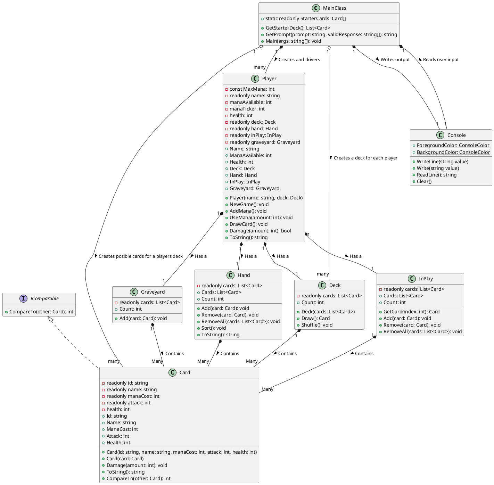
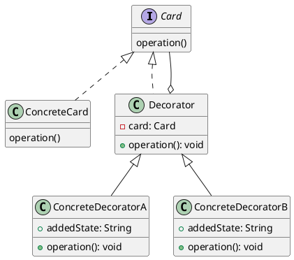
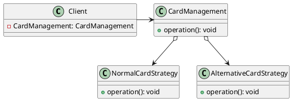
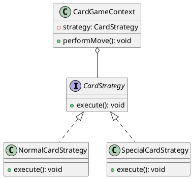
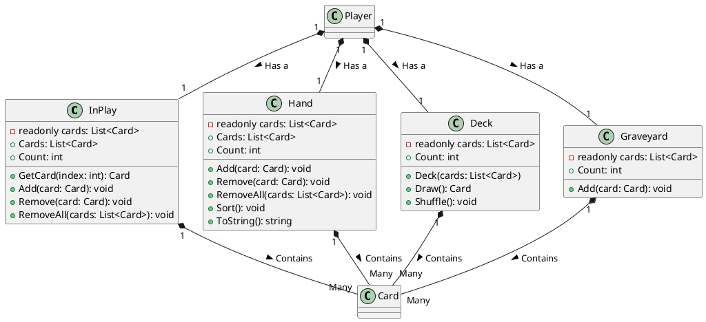
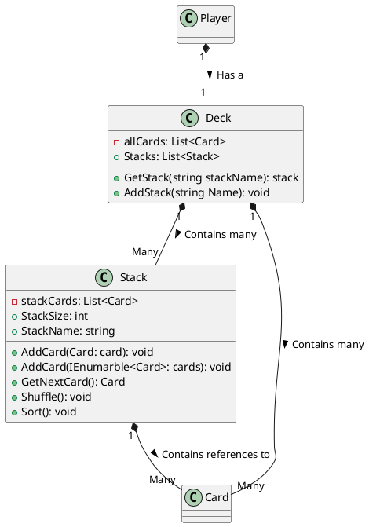

# Current Implementation:

## UML Diagram:

Here are some weaknesses in the current design and possible improvements:

1. **MainClass Responsibility Overload** :

* `MainClass` is doing too much. It handles game state, rules, user interaction, and setting up players decks. This violates the Single Responsibility Principle (SRP). It should delegate responsibilities to other classes.

1. **Player Class Coupling** :

* `Player` class knows too much about the game mechanics and directly interacts with the console for displaying information. This tight coupling makes it difficult to modify or extend the program.
* Consider separating the concerns related to player management (e.g., health, mana) from the concerns related to game logic and interaction.

1. **Lack of Abstraction** :

* Many classes are concrete implementations without interfaces or abstractions. Introducing interfaces can decouple components and make the code more flexible.
* For instance, `Player`, `Deck`, `Hand`, `InPlay`, and `Graveyard` could be abstracted into interfaces or base classes to allow for different implementations or extensions.

1. **Console Class Limitations** :

* The `Console` class is tightly coupled with the standard input/output operations, which makes it hard to test or replace with other input/output mechanisms.
* Consider abstracting the console interactions to allow for easier testing and potential support for different user interfaces.

1. **Inefficient Card Manipulation** :

* `Hand`, `Deck`, `InPlay`, and `Graveyard` classes all have similar methods for adding, removing, and counting cards. This duplication violates the DRY (Dont Repeat Yourself) principle.
* Consider refactoring these common functionalities into a shared base class or interface to reduce duplication and improve maintainability.

1. **Hardcoded Game Logic** :

* The current implementation assumes all games work the same way. This makes it challenging to adapt the code for different game rules or variations.
* Introduce a more flexible and extensible game logic system, possibly utilizing polymorphism and strategy patterns to allow for different game modes or rule variations.

1. **Limited Scalability** :

* The current design may not scale well for larger or more complex games. Consider breaking down the game logic into smaller, more manageable components and utilizing design patterns like MVC (Model-View-Controller) to separate concerns.

1. **Missing Error Handling** :

* Error handling is not addressed in the provided design. Consider implementing proper error handling mechanisms to handle unexpected scenarios gracefully.

To improve the design:

* Introduce abstractions/interfaces for key components such as players, cards, and game mechanics.
* Refactor the code to adhere to the SOLID principles, particularly the Single Responsibility Principle and Dependency Inversion Principle.
* Encapsulate behaviors within appropriate classes, ensuring loose coupling and high cohesion.
* Implement more flexible and extensible designs to accommodate future changes or game variations.
* Consider using design patterns such as Factory, Observer, or State pattern where applicable to enhance the flexibility and maintainability of the codebase.

##### Design Patteren for changing card behavour

## Decorator Pattern
The Decorator pattern is a structural design pattern that allows new functionality to be added to an existing object dynamically. This could be particularly useful for our card game if we have variable attributes on the cards that might need modifications during gameplay.

Heres an example of a UML diagram using the Decorator pattern:

## Façade Pattern
The Façade pattern is a structural design pattern that provides a simplified interface to a complex subsystem. It doesnt stop you from accessing the subsystem directly; however, it shields you from the complexity of the subsystem. In the context of a card game, this might be used to control the high-level logic of the game while masking the individual operations carried out by cards.

UML representation for the Facade pattern:

## Strategy Pattern
The Strategy pattern, a behavioral design pattern, enables an algorithms behavior to be selected at runtime. It defines a set of algorithms and makes them interchangeable. In the context of our card game, this could be an excellent choice for managing behavior that changes depending on state or specific cards (such as special abilities or effects).

Example UML diagram for the Strategy Pattern:

## Pros/Cons
### Decorator Pattern

#### Pros
1. **More flexibility:** You can mix and match decorators on runtime to change behavior as per needs.
2. **Single Responsibility Principle:** Classes remain focused on what they should be doing, since the additional functionalities are moved to separate classes.

#### Cons
1. **Increase in code complexity:** It introduces many small, similar classes into a system which increases complexity.
2. **Hard to understand:** The final object is wrapped multiple times with decorators which might make it harder to understand.

### Façade Pattern 

#### Pros
1. **Simplifies complex systems:** It hides the complexities and allows for simple high-level methods.
2. **Less coupling between client and subsystem:** Changes in subsystem classes won't affect the client's code.

#### Cons
1. **Limited functionality (sometimes):** A façade might not expose all functionalities of a subsystem making it unsuitable where advanced operations are needed.

### Strategy Pattern

#### Pros
1. **Easily switch algorithms or strategies:** You can replace one strategy with another as there are shared interface/abstract class.
2. **Decreases complexity:** By extracting the algorithm into separate classes, we reduce conditional complexity.

#### Cons
1. **Increased number of objects:** Each strategy is typically implemented in a new class, which increase the number of objects in application.
2. **Client must be aware of all strategies:** Client code needs to choose appropriate strategy and if a wrong one is chosen, it could lead to incorrect behaviour.

## Conclusion:
I believe that the most suitable patterns for managing the behavior of the cards are the Facade and Decorator patterns. The Strategy pattern primarily suits situations where a single mode of controlling a card is determined at the time of the card's creation.

The Facade pattern would be ideal if there are distinct types of cards that are well established and defined. However, given that this project is in its prototype phase, adjustments to card behavior will probably be frequently required.

I would recommend the Decorator pattern, as it allows for a combination of multiple different behaviors to be easily switched and interchanged. For instance, consider a situation where a card becomes progressively stronger each time it's used in an attack, and the cost to utilize the card decreases when a correlating card is active. These two enhancements can be layered onto a card simultaneously, maintaining game complexity while avoiding overcomplication by decoupling these elements.

# Refactoring:
## Stage 1: Drying out:

The way stacks of cards are handled are not great in the current implantation:
`Hand`, `Deck`, `InPlay`, and `Graveyard` classes all have similar methods for adding, removing, and counting cards. With the biggest differences being `Deck` being able to be shuffled and `Hand` with the ability to be sorted.

I would suggest placing all of these cards into a single collection a player owns and then add a dictionary to represent the current containers of cards

The methods to shuffle or to sort can be added as common functionality.

## Diagrams (UML diagrams simplified):

### Current Implementation:

### Proposed Implementation:

